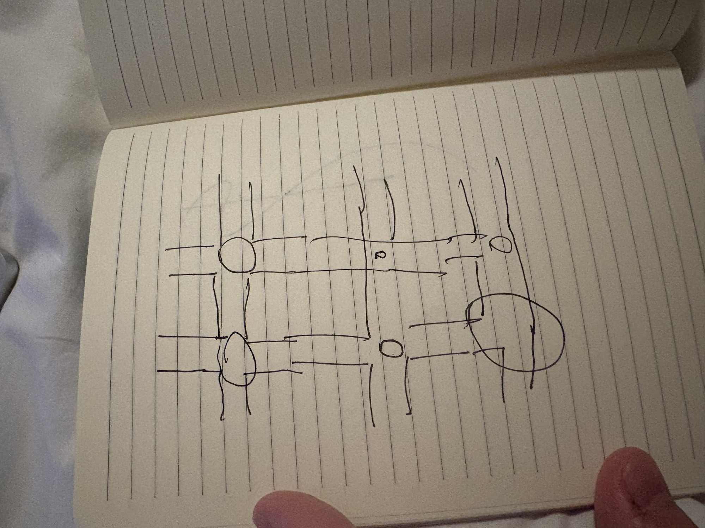
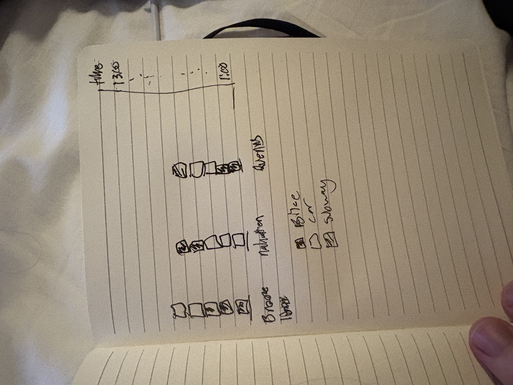

# Final Project Exploration 1 — The Daily Rhythm of a City

> Exploration, not commitment. The point of this document is to generate more directions than
> I will use, and to be specific enough about each one that I can kill it later for a real reason.

## 1. Topic and domain

I want to visualize **how a city moves through a single day** — and specifically, the fact that a
city does not have one circulatory system, it has four, and they hand off to each other.

New York publishes hourly, open, per-mode movement data for the subway, the buses, the yellow and
green taxis, the Uber/Lyft fleet, and the bike-share system. Each of those is normally visualized
alone. The subway data gets a ridership recovery chart. The taxi data gets a pickup heatmap. The
Citi Bike data gets a station map. I have not found a project that puts all of them on the same
24-hour clock, in the same geographic unit, and asks the question that only becomes askable once
they are together:

**When one system stops carrying the city, which one picks it up?**

That reframing is what makes this worth doing rather than redoing. The subway effectively thins out
overnight; taxi and for-hire vehicles do not. There is a crossover hour in every neighborhood where
the dominant mode changes hands, and I would bet that hour is different in Bushwick than it is in
Midtown, and different again on a Saturday than on a Tuesday. That difference is a portrait of what
a neighborhood is *for*.

**Why this domain.** The data is unusually honest: it is sensor and transaction data rather than
survey response, it is hourly rather than daily, it covers a decade, and it is still being updated
— the subway file currently runs through **27 August 2026**, five days before I wrote this. It is
also structurally complete for this course: it has time, geography, hierarchy, a genuine network,
and enough volume that aggregation is a design decision rather than a formality.

**The honest risk, stated up front.** NYC taxi data is the most-visualized open dataset in the
field. If I do this, the multi-modal handoff and the neighborhood typology are the reason it
exists. A pickup heatmap has been done, and done better than I would do it.

## 2. Questions I might investigate

### The handoff (the core thread)

1. **Where is the crossover hour?** For each neighborhood, at what hour does the subway stop being
   the dominant mode and the car fleet take over — and when does it hand back in the morning?
2. **Does the crossover time classify neighborhoods?** If I cluster areas purely by the *shape* of
   their 24-hour curve, ignoring volume and ignoring location entirely, do recognizable
   neighborhood types fall out — dormitory, business district, nightlife, transit hub, airport?
   Then: does the map of those clusters look like the map of New York I already have in my head?
3. **Is the evening commute the morning commute reversed?** I expect not. The morning peak should
   be sharper and more synchronized; the evening should be smeared across more hours because people
   leave work at different times but arrive at roughly the same one.

### The perturbations (what breaks the rhythm)

4. **What does rain do?** I expect bike share to collapse and for-hire vehicles to surge, with the
   subway barely moving. If that holds, the *ratio* of those elasticities is a single number that
   describes how substitutable the modes actually are.
5. **What did congestion pricing do?** NYC's central-business-district congestion charge began in
   January 2025, and TLC added a `cbd_congestion_fee` column to the trip files that year. I have
   hourly data for every mode on both sides of that date. This is a natural experiment sitting in
   public data, and the multi-modal view is the one that can show substitution rather than just
   a drop.
6. **Has the day itself changed shape since 2019?** The subway series reaches back to January 2017,
   so there is a real pre-2020 baseline. My hypothesis is that the *volume* recovered long before
   the *shape* did — that the morning peak is now flatter and later, and that this is a
   better-evidenced claim about remote work than most of the ones I have read.

### Questions I probably cannot answer, and why

7. **Why did any individual make any individual trip?** None of this data has a person in it. Every
   record is a vehicle or a fare, not a rider with a purpose. Any claim about intent is inference.
8. **Where did people actually go?** Yellow and green taxi records give a pickup and dropoff *zone*,
   not a route. Subway data gives an entry station and no exit at all. The paths in any flow map I
   draw will be inferred, and I need to say so on the chart rather than in a footnote.
9. **Who is missing?** Everyone who walked, drove a private car, or could not afford any of this.
   The data describes the people who paid a fare, which is not the same as the people who moved.

## 3. Datasets

### Primary candidates — all verified live and current

| Source | What it gives | Scale / range |
| --- | --- | --- |
| [NYC TLC Trip Records](https://www.nyc.gov/site/tlc/about/tlc-trip-record-data.page) | Yellow, green, FHV, and high-volume FHV (Uber/Lyft) trips: pickup/dropoff zone + timestamp, distance, itemized fare | Monthly Parquet, 2009 → May 2026. One month of Uber/Lyft alone is ~500 MB |
| [MTA Subway Hourly Ridership 2017–2019](https://data.ny.gov/d/t69i-h2me) · [2020–2024](https://data.ny.gov/d/wujg-7c2s) · [2025+](https://data.ny.gov/d/5wq4-mkjj) | Hourly ridership + transfers per station complex, split by fare class, with lat/long | ~223M rows total; current through 27 Aug 2026 |
| [MTA Bus Hourly Ridership 2020–2024](https://data.ny.gov/d/kv7t-n8in) · [2025+](https://data.ny.gov/d/gxb3-akrn) | Same shape, for bus routes | 152M rows in the 2025+ file alone |
| [Citi Bike System Data](https://citibikenyc.com/system-data) | Every trip: start/end station, coordinates, timestamps, member vs. casual | Monthly CSV from an [open S3 bucket](https://s3.amazonaws.com/tripdata/index.html), 2013 → present |
| [NYC Bicycle and Pedestrian Counts](https://data.cityofnewyork.us/d/ct66-47at) | Automated counter readings by sensor, mode, direction, timestamp | The only foot-traffic signal in the set |

### Joining them — the technical spine

Everything collapses onto a **`(taxi zone, hour)`** key:

- TLC already gives `PULocationID` / `DOLocationID` against the
  [taxi zone lookup](https://d37ci6vzurychx.cloudfront.net/misc/taxi_zone_lookup.csv) — 265 codes,
  of which 263 are real zones and two are catch-alls for unknown pickups.
- Subway and Citi Bike give lat/long, so a point-in-polygon against the
  [taxi zone shapefile](https://d37ci6vzurychx.cloudfront.net/misc/taxi_zones.zip) (1 MB) puts them
  in the same 263 buckets.

That single join is the whole project. If it works, every question above becomes a group-by. If it
turns out to be lossy in some way I have not anticipated, I want to find that out in week 3, not
week 11.

### Supporting / contextual

- **[Open-Meteo Historical Weather API](https://open-meteo.com/en/docs/historical-weather-api)** —
  hourly ERA5 reanalysis, free for non-commercial use, no key required. Gives me precipitation and
  temperature for every hour in the study period, which is what turns question 4 from a guess into
  a measurement.
- **[Census ACS](https://www.census.gov/programs-surveys/acs)** — residential population per tract,
  to normalize. Without it, every map I draw is partly just a population map, and the brightest
  zone is always Midtown for uninteresting reasons.

### What I would still like and do not have

- **Exit data for the subway.** Entries only means I can see the city inhale but not exhale. The
  taxi data has both ends; the subway data has one. This asymmetry will shape what I can claim.
- **Anything with a person in it.** A panel that follows the same rider across modes would answer
  the substitution question directly instead of by inference from aggregates.
- **Private-car volumes.** Bridge and tunnel counts, or DOT traffic sensors, to cover the mode that
  is invisible in all of the above.
- **An events calendar.** Games, concerts, parades. Half the anomalies in an hourly series are
  Madison Square Garden letting out, and without a calendar I will be annotating spikes by guessing.

## 4. Related work and inspiration

### The prior art I have to be aware of

- **[Todd Schneider — "Analyzing 1.1 Billion NYC Taxi and Uber Trips, with a Vengeance"](https://toddwschneider.com/posts/analyzing-1-1-billion-nyc-taxi-and-uber-trips-with-a-vengeance/)**
  — the canonical treatment, and the standard I would be measured against. It covers taxi vs. Uber
  substitution thoroughly. What it does *not* do is bring the subway, bus, and bike systems into the
  same frame, and it is static rather than interactive. That gap is where my project lives.
- **[Chris Whong — "NYC Taxis: A Day in the Life"](https://chriswhong.github.io/nyctaxi/)** — follows
  a single cab through a single day. The opposite altitude from mine, and a good reminder that one
  vehicle can be more legible than a million.

### Form and craft references

- **[Nathan Yau — "A Day in the Life of Americans"](https://flowingdata.com/2015/12/15/a-day-in-the-life-of-americans/)**
  and **["A Day in the Life: Work and Home"](https://flowingdata.com/2017/05/17/american-workday/)**
  — the closest thing to what I want emotionally: a 24-hour cycle you watch rather than read, built
  from the American Time Use Survey. The animation makes the rhythm *felt* in a way a line chart
  does not.
- **[deck.gl Trips Layer](https://deck.gl/examples/trips-layer)** — the reference implementation for
  animated movement over a basemap, and a useful reality check on what it costs to render.
- **[The Pudding](https://pudding.cool)** — for scroll structure carrying an argument, which matters
  because my questions are sequential: first the rhythm, then the typology, then what breaks it.
- **[The Upshot](https://www.nytimes.com/section/upshot)** — for restraint and for annotation placed
  on the mark rather than in a caption.
- **[Datawrapper Blog](https://blog.datawrapper.de)** — the practical reference for the decisions I
  keep getting wrong, especially when a map is the wrong chart.

### What I specifically want to borrow

Three things: **the cycle as the primary form** rather than a left-to-right timeline; **one claim per
chart**; and **stating the limits on the chart itself** — which matters here because inferred routes
and entry-only subway data are both easy to draw more confidently than they deserve.

## 5. Sketches

> Quick and disposable on purpose. I tried to make each one a *different kind* of chart rather than
> six versions of the best one, because at this stage I do not know which structure the data wants.

### Sketch 1 — The day as a circle, not a line

**What I was thinking:** A linear x-axis lies about midnight — it puts 11pm and 1am at opposite ends
of the page when they are adjacent in every sense that matters for this data. So the first thing I
wanted to try was the day as an actual cycle, with each mode as a concentric ring whose thickness is
its volume. The thing I want to be able to see instantly is the two places where the rings swap
order. I am unsure whether four rings is already too many, and whether thickness read radially is
too weak a channel for the comparison I care most about.

### Sketch 2 — 263 neighborhoods, 263 little curves

**What I was thinking:** Strip out volume and location entirely, normalize every zone to its own
peak, and lay all 263 curves out as a grid of sparklines sorted so similar shapes sit together. This
is the sketch I am most optimistic about, because it turns a map question into a pattern-matching
question, and the eye is very good at spotting that a handful of shapes recur. If distinct families
of curve fall out here, the whole project has a spine. If everything looks like the same
double-humped commuter curve, this direction is dead and I would want to know that early.

### Sketch 3 — The handoff

**What I was thinking:** The same question as Sketch 1 but in the most boring possible form, as a
control. Mode *share* rather than counts, stacked to 100%, so the handoff is a change in band
thickness rather than something I have to infer from four separate lines. The reason to draw the dull
version is that it might simply be better — if the stacked area answers the question more clearly
than the radial one, the radial one is decoration and should go. Repeating it for a weekend day is
the cheapest way to check whether the pattern is about *time* or about *work*.

### Sketch 4 — The typology map

**What I was thinking:** This is the payoff for Sketch 2 — take the cluster each zone landed in and
put it back on the map. What I want to know is whether a classification derived *purely from timing*,
with no geography in the input at all, reconstructs the geography anyway. If the nightlife cluster
lands on the places I know to be nightlife, that is a real validation. The channel has to be
categorical hue rather than intensity, and with five categories on 263 small irregular polygons I
suspect legibility is going to be the whole battle.

### Sketch 5 — The morning is not the evening reversed

**What I was thinking:** Treating the origin-destination pairs as a weighted network rather than as
points on a map. My hypothesis is that the morning inflow is concentrated and synchronized while the
evening outflow is diffuse and smeared, because arrival times are coordinated by employers and
departure times are not. Drawing it as two side-by-side flow maps is the most direct way to test
that. I am wary of this one — flow maps over a dense city turn into spaghetti almost immediately,
and I may need to abandon the map and use a matrix or a chord diagram instead.

### Sketch 6 — What rain does

**What I was thinking:** Small multiples, one panel per mode, with the dry-hour and wet-hour profiles
overlaid so the *gap between the two lines* is the encoded quantity. I like this because it makes an
elasticity legible without asking anyone to read a coefficient — the size of the gap is the answer,
and the four panels can be compared at a glance. The same structure would work unchanged for the
congestion-pricing before/after, which is a good sign that the form is doing real work rather than
being fitted to one question.

## 6. Format

Leaning **scrollytelling that resolves into a dashboard**. The first two thirds are guided, because
the argument is sequential and a reader dropped cold into a 263-zone crossfilter will not find the
handoff on their own. Then it opens up: same views, all controls unlocked, pick your own
neighborhood. The course's [crossfiltering stepladder](CROSSFILTERING_STEPLADDER.md) is the natural
build order for the second half.

The alternative worth trying is an **app framing** — "your neighborhood's rhythm," you type an
address, you get its fingerprint and its cluster and its crossover hour. Narrower, more personal,
more likely to get shared, and considerably less ambitious. Worth prototyping before deciding.

## 7. Adjacent directions I am keeping open

Deliberately not committing yet. Each of these keeps the "rhythm" question and swaps the data:

- **A second city, for contrast.** Chicago publishes comparable taxi data
  ([2013–2023](https://data.cityofchicago.org/d/wrvz-psew), [2024–](https://data.cityofchicago.org/d/ajtu-isnz))
  keyed to community areas, and [TfL](https://cycling.data.tfl.gov.uk/) publishes London cycle hire.
  A two-city comparison would test whether any of this is about cities or just about New York.
- **The national day rather than the city day.** The
  [American Time Use Survey](https://www.bls.gov/tus/) is what Nathan Yau used — self-reported
  activity rather than sensor data, which trades precision for actually knowing *why* someone moved.
- **The rhythm of something other than people.** The
  [EIA Hourly Electric Grid Monitor](https://www.eia.gov/electricity/gridmonitor/) has hourly
  generation by fuel type per balancing authority. Same diurnal structure, same overview+detail
  problem, completely different subject — the city breathing in electricity instead of commuters.

---

## Notes

Every dataset link in this document was fetched and confirmed resolving on 2 September 2026, and the
row counts and file sizes quoted are from live queries against the source APIs rather than from
documentation. The sketch captions describe what I *intended* before drawing; where the drawing
diverged, the drawing is the honest record and I will update the text to match.
