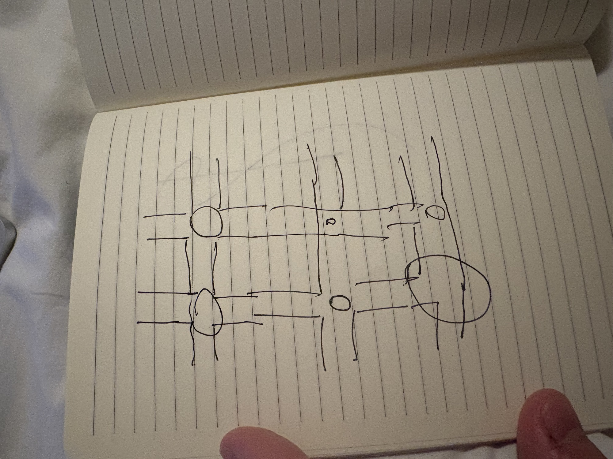
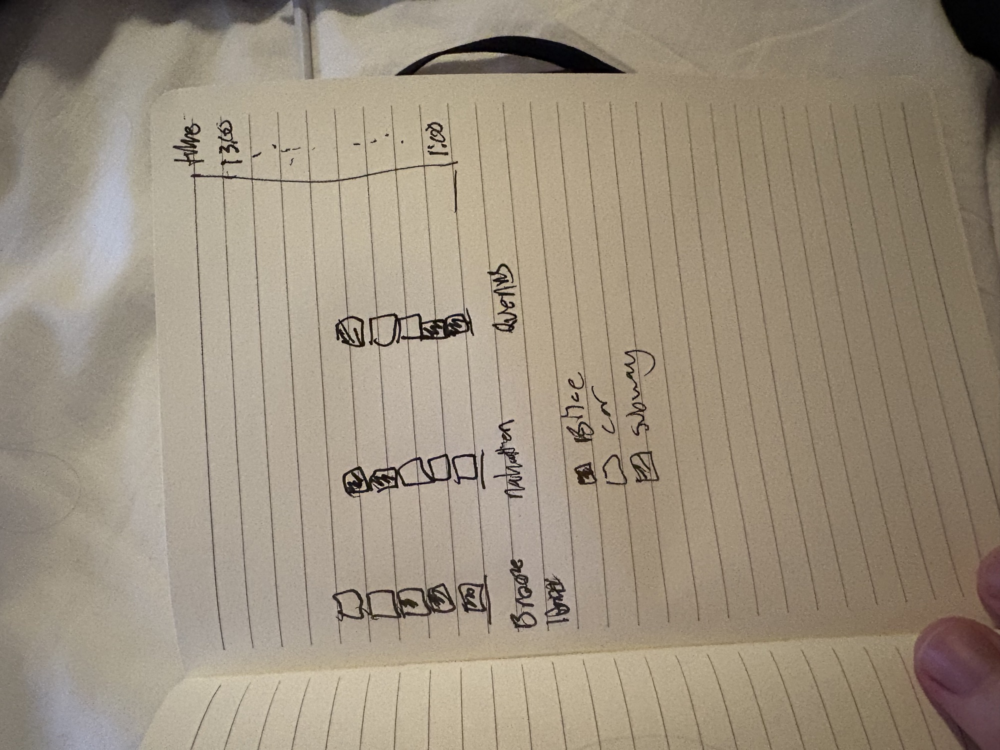

# Final Project Exploration 1 — The Daily Rhythm of a City

> Exploration, not commitment. The point of this document is to generate more directions than
> I will use, and to be specific enough about each one that I can kill it later for a real reason.

## 1. Topic and domain

I want to visualize **how a city moves through a single day** — and specifically, the fact that a
city does not have one circulatory system, it has four, and they hand off to each other.

New York publishes hourly, open, per-mode movement data for the subway, the buses, the yellow and
green taxis, the Uber/Lyft fleet, and the bike-share system. Each of those is normally visualized
alone. The subway data gets a ridership recovery chart. The taxi data gets a pickup heatmap. The
Citi Bike data gets a station map. I have not found a project that puts all of them on the same
24-hour clock, in the same geographic unit, and asks the question that only becomes askable once
they are together:

**When one system stops carrying the city, which one picks it up?**

That reframing is what makes this worth doing rather than redoing. The subway effectively thins out
overnight; taxi and for-hire vehicles do not. There is a crossover hour in every neighborhood where
the dominant mode changes hands, and I would bet that hour is different in Bushwick than it is in
Midtown, and different again on a Saturday than on a Tuesday. That difference is a portrait of what
a neighborhood is _for_.

**Why this domain.** The data is unusually honest: it is sensor and transaction data rather than
survey response, it is hourly rather than daily, it covers a decade, and it is still being updated
— the subway file currently runs through **27 August 2026**, five days before I wrote this. It is
also structurally complete for this course: it has time, geography, hierarchy, a genuine network,
and enough volume that aggregation is a design decision rather than a formality.

**The honest risk, stated up front.** NYC taxi data is the most-visualized open dataset in the
field. If I do this, the multi-modal handoff and the neighborhood typology are the reason it
exists. A pickup heatmap has been done, and done better than I would do it.

## 2. Questions I might investigate

### The handoff (the core thread)

1. **Where is the crossover hour?** For each neighborhood, at what hour does the subway stop being
   the dominant mode and the car fleet take over — and when does it hand back in the morning?
2. **Does the crossover time classify neighborhoods?** If I cluster areas purely by the _shape_ of
   their 24-hour curve, ignoring volume and ignoring location entirely, do recognizable
   neighborhood types fall out — dormitory, business district, nightlife, transit hub, airport?
   Then: does the map of those clusters look like the map of New York I already have in my head?
3. **Is the evening commute the morning commute reversed?** I expect not. The morning peak should
   be sharper and more synchronized; the evening should be smeared across more hours because people
   leave work at different times but arrive at roughly the same one.

### The perturbations (what breaks the rhythm)

4. **What does rain do?** I expect bike share to collapse and for-hire vehicles to surge, with the
   subway barely moving. If that holds, the _ratio_ of those elasticities is a single number that
   describes how substitutable the modes actually are.
5. **What did congestion pricing do?** NYC's central-business-district congestion charge began in
   January 2025, and TLC added a `cbd_congestion_fee` column to the trip files that year. I have
   hourly data for every mode on both sides of that date. This is a natural experiment sitting in
   public data, and the multi-modal view is the one that can show substitution rather than just
   a drop.
6. **Has the day itself changed shape since 2019?** The subway series reaches back to January 2017,
   so there is a real pre-2020 baseline. My hypothesis is that the _volume_ recovered long before
   the _shape_ did — that the morning peak is now flatter and later, and that this is a
   better-evidenced claim about remote work than most of the ones I have read.

### Questions I probably cannot answer, and why

7. **Why did any individual make any individual trip?** None of this data has a person in it. Every
   record is a vehicle or a fare, not a rider with a purpose. Any claim about intent is inference.
8. **Where did people actually go?** Yellow and green taxi records give a pickup and dropoff _zone_,
   not a route. Subway data gives an entry station and no exit at all. The paths in any flow map I
   draw will be inferred, and I need to say so on the chart rather than in a footnote.
9. **Who is missing?** Everyone who walked, drove a private car, or could not afford any of this.
   The data describes the people who paid a fare, which is not the same as the people who moved.

## 3. Datasets

### Primary candidates — all verified live and current

| Source                                                                                                                                                             | What it gives                                                                                                       | Scale / range                                                                                      |
| ------------------------------------------------------------------------------------------------------------------------------------------------------------------ | ------------------------------------------------------------------------------------------------------------------- | -------------------------------------------------------------------------------------------------- |
| [NYC TLC Trip Records](https://www.nyc.gov/site/tlc/about/tlc-trip-record-data.page)                                                                               | Yellow, green, FHV, and high-volume FHV (Uber/Lyft) trips: pickup/dropoff zone + timestamp, distance, itemized fare | Monthly Parquet, 2009 → May 2026. One month of Uber/Lyft alone is ~500 MB                          |
| [MTA Subway Hourly Ridership 2017–2019](https://data.ny.gov/d/t69i-h2me) · [2020–2024](https://data.ny.gov/d/wujg-7c2s) · [2025+](https://data.ny.gov/d/5wq4-mkjj) | Hourly ridership + transfers per station complex, split by fare class, with lat/long                                | ~223M rows total; current through 27 Aug 2026                                                      |
| [MTA Bus Hourly Ridership 2020–2024](https://data.ny.gov/d/kv7t-n8in) · [2025+](https://data.ny.gov/d/gxb3-akrn)                                                   | Same shape, for bus routes                                                                                          | 152M rows in the 2025+ file alone                                                                  |
| [Citi Bike System Data](https://citibikenyc.com/system-data)                                                                                                       | Every trip: start/end station, coordinates, timestamps, member vs. casual                                           | Monthly CSV from an [open S3 bucket](https://s3.amazonaws.com/tripdata/index.html), 2013 → present |
| [NYC Bicycle and Pedestrian Counts](https://data.cityofnewyork.us/d/ct66-47at)                                                                                     | Automated counter readings by sensor, mode, direction, timestamp                                                    | The only foot-traffic signal in the set                                                            |

### Joining them — the technical spine

Everything collapses onto a **`(taxi zone, hour)`** key:

- TLC already gives `PULocationID` / `DOLocationID` against the
  [taxi zone lookup](https://d37ci6vzurychx.cloudfront.net/misc/taxi_zone_lookup.csv) — 265 codes,
  of which 263 are real zones and two are catch-alls for unknown pickups.
- Subway and Citi Bike give lat/long, so a point-in-polygon against the
  [taxi zone shapefile](https://d37ci6vzurychx.cloudfront.net/misc/taxi_zones.zip) (1 MB) puts them
  in the same 263 buckets.

That single join is the whole project. If it works, every question above becomes a group-by. If it
turns out to be lossy in some way I have not anticipated, I want to find that out in week 3, not
week 11.

### Supporting / contextual

- **[Open-Meteo Historical Weather API](https://open-meteo.com/en/docs/historical-weather-api)** —
  hourly ERA5 reanalysis, free for non-commercial use, no key required. Gives me precipitation and
  temperature for every hour in the study period, which is what turns question 4 from a guess into
  a measurement.
- **[Census ACS](https://www.census.gov/programs-surveys/acs)** — residential population per tract,
  to normalize. Without it, every map I draw is partly just a population map, and the brightest
  zone is always Midtown for uninteresting reasons.

### What I would still like and do not have

- **Exit data for the subway.** Entries only means I can see the city inhale but not exhale. The
  taxi data has both ends; the subway data has one. This asymmetry will shape what I can claim.
- **Anything with a person in it.** A panel that follows the same rider across modes would answer
  the substitution question directly instead of by inference from aggregates.
- **Private-car volumes.** Bridge and tunnel counts, or DOT traffic sensors, to cover the mode that
  is invisible in all of the above.
- **An events calendar.** Games, concerts, parades. Half the anomalies in an hourly series are
  Madison Square Garden letting out, and without a calendar I will be annotating spikes by guessing.

## 4. Related work and inspiration

### The prior art I have to be aware of

- **[Todd Schneider — "Analyzing 1.1 Billion NYC Taxi and Uber Trips, with a Vengeance"](https://toddwschneider.com/posts/analyzing-1-1-billion-nyc-taxi-and-uber-trips-with-a-vengeance/)**
  — the canonical treatment, and the standard I would be measured against. It covers taxi vs. Uber
  substitution thoroughly. What it does _not_ do is bring the subway, bus, and bike systems into the
  same frame, and it is static rather than interactive. That gap is where my project lives.
- **[Chris Whong — "NYC Taxis: A Day in the Life"](https://chriswhong.github.io/nyctaxi/)** — follows
  a single cab through a single day. The opposite altitude from mine, and a good reminder that one
  vehicle can be more legible than a million.

### Form and craft references

- **[Nathan Yau — "A Day in the Life of Americans"](https://flowingdata.com/2015/12/15/a-day-in-the-life-of-americans/)**
  and **["A Day in the Life: Work and Home"](https://flowingdata.com/2017/05/17/american-workday/)**
  — the closest thing to what I want emotionally: a 24-hour cycle you watch rather than read, built
  from the American Time Use Survey. The animation makes the rhythm _felt_ in a way a line chart
  does not.
- **[deck.gl Trips Layer](https://deck.gl/examples/trips-layer)** — the reference implementation for
  animated movement over a basemap, and a useful reality check on what it costs to render.
- **[The Pudding](https://pudding.cool)** — for scroll structure carrying an argument, which matters
  because my questions are sequential: first the rhythm, then the typology, then what breaks it.
- **[The Upshot](https://www.nytimes.com/section/upshot)** — for restraint and for annotation placed
  on the mark rather than in a caption.
- **[Datawrapper Blog](https://blog.datawrapper.de)** — the practical reference for the decisions I
  keep getting wrong, especially when a map is the wrong chart.

### What I specifically want to borrow

Three things: **the cycle as the primary form** rather than a left-to-right timeline; **one claim per
chart**; and **stating the limits on the chart itself** — which matters here because inferred routes
and entry-only subway data are both easy to draw more confidently than they deserve.

## 5. Sketches

## 6. Task Analysis

What the visualization has to let someone do, stated independently of what it looks like. Nothing
below names a chart, an axis, or an interaction — that is the point. A task like "compare the
morning peak against the evening peak" could be served by two small maps side by side, a slope
chart, a matrix, or an animation, and choosing between those is a later decision that should be
argued on the merits rather than assumed now.

**Who has these goals.** People who already know New York and carry a mental model of it — they
know Midtown empties at night and that some neighborhoods only start moving at 11pm. The value is
in the places where the data disagrees with what they expect.

### Goals

The higher-level reasons someone would come to this at all:

- **G1. Build an accurate picture of the shape of the city's day**, as distinct from its total
  volume. Most transit coverage reports totals; the shape is the part that carries meaning.
- **G2. Test a belief they already hold.** Find one specific neighborhood and confirm or overturn
  what they assume about how it behaves.
- **G3. Understand whether the modes compete or complement.** Decide whether New York has one
  circulatory system or four that hand off to each other.
- **G4. Attribute a change to a cause.** Connect a departure from the usual rhythm to weather, a
  policy, an event, or the slow shift since 2019.

### Tasks

The specific things a reader must be able to do. Each says what the trend is and what would count
as actually finding it.

**T1. Summarize the daily cycle in mode share.** Whether the mix of modes carrying a neighborhood
rises and falls over 24 hours, and where one mode overtakes another. Found if the crossover hour is
stable within a neighborhood and clearly different between neighborhoods. _(G1, G3)_

**T2. Compare 24-hour profiles across zones to find recurring shapes.** Whether the 263 zones
collapse into a few families of curve. Found if a handful of shapes account for most zones, and
those shapes match recognizable kinds of place — dormitory, business district, nightlife, transit
hub, airport. _(G1, G2)_

**T3. Compare the morning peak against the evening peak.** Whether the evening is the morning
reversed. I expect not: arrivals are coordinated by employers and departures are not, so the
evening should be flatter and smeared across more hours. _(G1)_

**T4. Query what happens to one mode when another is suppressed.** When rain, a holiday, or
congestion pricing pushes trips off one mode, whether they turn up in another or simply vanish.
Found if a drop in one series is matched in time by a rise in another. _(G3, G4)_

**T5. Search for departures from the usual shape, at two scales.** Single hours that break a zone's
own curve — a game, a storm, a service outage — and the slower question of whether the shape of the
whole day has shifted since 2019, with the morning peak flatter and later. The subway series
reaches back to 2017, so the baseline exists to compare against. _(G2, G4)_

### Lookup, not just overview

One task cuts across all five and is easy to leave out: **retrieve a value for a named place and
hour.** Whatever form this takes, someone has to be able to find their own neighborhood at 6pm on a
Tuesday and read the actual number, not just see a shape. Without that, none of the goals above
survive contact with a reader who wants to check the claim.

## 7. Validation

Munzner's nested model says the same project can fail in four unrelated ways, and that each failure needs its own kind of evidence. The point of this section is not to claim the project is validated. it is to write down, before building anything, what would count as being wrong at each level, and what I would have to do to find out.

### The imagined user

My **primary user is an informed New York resident** someone from the city and who commutes enough to have opinions about the subway at 11pm.

My **secondary user is a transit-beat reporter or an advocacy researcher** — someone who needs to check a claim ("did congestion pricing push people onto the subway or just out of Manhattan?") and who would use this to find a story rather than to finish one. This user matters because they have a real task that exists whether or not I build anything, which is a useful discipline.

### Level 1 — Domain situation

**What I could get wrong.** That the crossover hour is a concept I find interesting rather than one anyone else does. I did the framing in §1 and then built a task analysis on top of it, which is exactly the loop the nested model warns about — the designer as their own user, mistaking their curiosity for a need. The more likely real question a New Yorker has is narrower and more selfish: is my commute getting worse, and is it worse than everyone else's?

**Upstream — before building.** Observe rather than ask. The cheapest useful method is to have five
or six New Yorkers **predict their own neighborhood's 24-hour curve by drawing it**, before seeing any data, then talk through what surprised them. That elicits the mental model directly instead of asking them to describe it, and it tells me whether the gap between belief and data.

**Downstream — after deploying.** A field study rather than a lab study: put it somewhere public and watch what people actually do with it, not what they do when I hand them a task. The signals I would look for are which zones get looked up (their own? or the famous ones?), whether anyone uses the public transportation.

### Level 2 — Abstraction

This is the level where I think this project is genuinely most at risk, and it is also the level where a lab study cannot help me.

**The data abstraction, and why it is a choice.** I am not drawing the data I was given. The raw material is ~223M rows of subway entries, 152M of bus, and roughly 500 MB per month of Uber and Lyft trips. What I actually intend to draw is a small derived cube keyed by **`(taxi zone, hour, mode, day type)`**, carrying a normalized share and two further derived attributes: a **crossover hour** per zone, and a **categorical curve type** per zone produced by clustering the shape. Every one of those is an invention. None of them exist in the source files.

**What I could get wrong, concretely:**

- **The join does not compare like with like.** A taxi pickup is where a person physically was. A subway entry is where a person walked to, which can be half a mile away, and the zone boundary will absorb that walk differently in Midtown than in Bay Ridge. If the two modes are measuring different spatial things, then every crossover hour is partly a geometry artifact, and the neighborhood typology in T2 is clustering my join error.
-
- **Normalization changes the answer.** Raw counts, per-resident, or share-of-that-zone's-own-daily total are three different maps, and only the third one actually isolates _shape_ from _volume_, which is what G1 claims to be about.
- **The task abstraction may be the wrong shape.** T1–T5 are mine. If the real task is lookup — "my neighborhood, 6pm, Tuesday, what is the number" — then the overview-first structure is backwards, and the best encoding in the world will not fix it. I hedged toward this already in §6 with the "lookup, not just overview" note, which in hindsight reads like an abstraction I do not fully believe in yet.

**Downstream.** This is the level Munzner is most explicit about: **task abstractions are very hard
to validate with controlled experiments**, because a lab study works by telling people what to do,
which assumes the answer. The only real evidence is watching people use it in a realistic setting
and seeing which questions they actually bring to it. If the reporter never touches the typology
view and goes straight to a single-zone time series every time, my task abstraction was wrong no
matter how well the typology view tested in a lab.

### Level 3 — Idiom

**The candidates.** For encoding: a radial 24-hour clock or a linear line chart

- **The radial clock is the biggest risk, and it is my favorite idea** — §4 says outright that I want "the cycle as the primary form." But angle and arc length are weak channels for precise comparison next to aligned position, so the form that best conveys _cyclicality_ is close to the worst one for T3, which is an explicit precision comparison of morning against evening. Wanting the form is not a reason.
- **Animated flow maps communicate motion and little else.** Two moments in time cannot be compared
  when one of them is a memory, so an animation cannot serve T3 or T4 no matter how good it looks.
- **Crossover hour is cyclic data.** Hour 23 and hour 0 are adjacent, so a sequential ramp will
  draw a hard seam across the map exactly where there is no discontinuity. It needs a cyclic
  colormap, and this is the kind of error that looks like a finding.
- **Inferred routes drawn as confident arcs** assert precision the data does not have — the exact
  failure §4 says I want to avoid by "stating the limits on the chart itself."

### Level 4 — Algorithm

**The decision the model surfaces.** The idiom level's need for immediate response is what dictates the architecture: all of the expensive work goes offline, and the browser only ever receives the aggregate cube. That cube is 263 zones × 24 hours × ~5 modes × a few day types — low hundreds of thousands of rows, a few megabytes — which is small enough that every interaction is a filter over data already in memory.

---

## 8. V1 — the handoff, built

**Where it is:** [`src/assignments/week-06`](../src/assignments/week-06), running as Week 6 in the
deployed site (`?example=6`). The pipeline behind it is
[`scripts/build-rhythm-cube.sh`](../scripts/build-rhythm-cube.sh); the cube it writes is in
[`public/data/nyc-rhythm/`](../public/data/nyc-rhythm).

This is a first rough version of **T1 — summarize the daily cycle in mode share**, which §6 calls the
core thread. It covers one month (June 2025), three modes, and the lookup task; it does not attempt
the typology (T2), the morning-against-evening comparison (T3), the perturbations (T4), or the
shift since 2019 (T5).

### What it does

One taxi zone's 24 hours drawn as a 100% stacked area, subway against the baseline, so the hour the
subway's band crosses the half line is the hour the taxi and for-hire fleets together start carrying
more of the zone than it does. That hour is marked on the mark with the time printed on it. Below,
the busiest zones that hand over are shown as small multiples ordered by when they do it, which
doubles as the picker. Weekday and weekend are a toggle; hovering any hour gives every mode's share
and its actual count.

Three decisions worth recording, because each one was a choice the document had left open:

- **The day starts at 04:00, not midnight.** §7 flagged that crossover hour is cyclic data and that
  a seam drawn in the wrong place looks like a finding. The handoff happens at night, so a midnight
  origin cuts the story in half. 04:00 is the trough of the subway's day in every zone checked.
- **Stacked bands, not lines.** §7 Level 3 argued for aligned position over angle, and that still
  holds, but three _lines_ fail for a different reason: the subway carries 85–95% of a residential
  zone's morning, which pins the other two to the floor. Stacked, every mode keeps a visible band,
  and the subway's own edge is the thing being read against the half line.
- **The crossover is one line crossing one threshold.** Because the three shares sum to one,
  "the subway carries more than the car fleet combined" is exactly "the subway is above a half". The
  50% rule is therefore the handoff itself rather than a decoration.

### What it settled

**The join works, and it was the right thing to test first.** §3 said the single `(taxi zone, hour)`
key "is the whole project" and §7 said the biggest risk was that the join does not compare like with
like. Mechanically it is clean: all 428 subway station complexes land in exactly one taxi zone by
point-in-polygon, with no manual crosswalk and nothing unmatched. 153 of the 263 zones contain at
least one complex.

**The architecture holds.** ~25M trip records and a month of hourly ridership reduce to 12,624 rows
and 365 KB. Every interaction in the browser is a filter over data already in memory, as §7 Level 4
assumed it would have to be.

**The crossover hour does separate neighbourhoods — but into three groups, not a continuum.** Of the
173 zones with at least 2,000 trips on a typical weekday:

|                  | zones | what they are                                                                  |
| ---------------- | ----- | ------------------------------------------------------------------------------ |
| Hand over        | 111   | The subway leads by day and loses the night, mostly between 21:00 and midnight |
| Never hand over  | 38    | The subway carries more than half of _every_ hour — the big interchanges       |
| Never reach half | 24    | Airports and places the subway does not really serve                           |

That three-way split is itself the first result for T2, and it arrived without any clustering: the
shape of the question produced the classes.

**The Manhattan core holds out longest.** Residential outer-borough zones hand over around 22:00–00:00;
Midtown South at 01:55, Times Square at 02:24. The hypothesis in §1 — that the crossover hour differs
between Bushwick and Midtown — is supported, and the direction is the one predicted.

**Weekends loosen the subway's grip.** 127 zones hand over rather than 111, and only 16 hold all day
rather than 38. The morning handback moves later: East Village returns to the subway at 04:59 on a
weekday and 05:55 on a weekend. §1 guessed Saturday would differ from Tuesday; it does, and more in
the shape of the night than in the volume of the day.

### What it did not settle, and what that costs

**The unit mismatch is unresolved and it bounds every number on the chart.** The subway figure counts
people through a turnstile; the taxi and for-hire figures count vehicles, each carrying one or more.
The half line is therefore not a headcount. The handoff times are sound _relative to each other_ —
which is what the neighbourhood comparison needs — but not as absolutes, and no amount of design
fixes this. It is stated on the chart rather than in a footnote, per §4. Resolving it needs an
occupancy assumption for for-hire trips, and that assumption should be visible and adjustable rather
than baked in.

**The geometry artifact §7 predicted is real, and I can now point at it.** Midtown Center is the
single highest-volume taxi zone in New York and holds exactly one small station complex, because the
big ones sit over its borders in the Garment District and Midtown East. It therefore reads as
"handing over at 18:55" for cartographic reasons rather than behavioural ones. The V1 does not solve
this; it surfaces each zone's complex count so the reader can catch it. The real fix is a catchment
that is not the taxi zone — a walk-radius around each complex, or an areal reapportionment — and
that is now a known piece of work rather than a worry.

**Two modes are missing, for a stated reason.** Bus and Citi Bike are deferred. A stacked or line
form puts every series beside every other one, so the palette has to separate on all pairs, and the
validated palette this repo has used since Week 2 holds three slots to that standard. Adding a fourth
hue would put two confusable colours on the axes the chart exists to read a crossing off. Bringing
them in means either faceting or dropping the single-chart form.

### What this changes about the plan

1. **T2 is cheaper than it looked.** The three-way split falls out of T1's own threshold, so the
   typology work can start from "what distinguishes the 111 from each other" rather than from
   clustering 263 raw curves.
2. **The catchment problem is promoted.** It was a §7 worry; it is now a specific, reproducible
   artifact with a named example, and it should be fixed before any map is drawn — a choropleth of
   crossover hour would render that artifact as geography and make it look like a finding.
3. **"Lookup, not just overview" earned its place.** The hover readout giving both share and count is
   the thing that makes the caveat survivable: a reader who distrusts the half line can read the two
   raw numbers and judge for themselves. §6 hedged on whether that task was real; it is, and it is
   load-bearing rather than a nicety.
4. **The radial clock is now a harder sell.** §4 wanted the cycle as the primary form and §7 admitted
   that wanting it is not a reason. Having drawn the linear version, the thing that makes it work is
   reading the subway edge against a straight horizontal rule. A radial version would have to replace
   that rule with a circle, and comparing a curve against a circle is the comparison this chart is
   least able to afford to lose.
